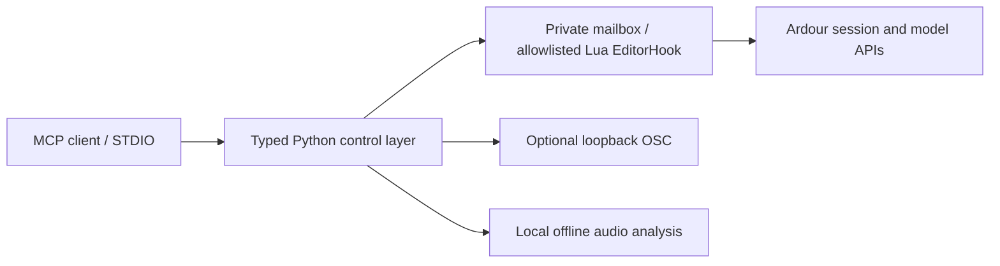

# Ardour Ultra MCP

**Precise, local control of Ardour for MCP clients.** Inspect a session, edit MIDI, adjust plugins, build automation and measure rendered audio through Ardour's real scripting APIs.

[](https://github.com/Elias02345/ardour-ultra-mcp/actions/workflows/ci.yml)
[](LICENSE)
[](pyproject.toml)

[**Deutsch: Installation Schritt für Schritt**](docs/INSTALLATION.de.md) · [Installation](docs/INSTALLATION.md) · [MCP client setup](docs/MCP_CLIENTS.md) · [All documentation](docs/README.md)

The server is free, open source and local. It needs no API key, cloud service or proprietary model. Your choice of MCP client and model is separate. Control uses a reviewed Lua hook and optional native OSC; no mouse coordinates or image recognition.

**Status: development release 0.1.0.** Linux Ardour 9.8 has native integration evidence; 8.12 has a smaller tested feature set. The Python/MCP layer passes CI on Linux, macOS and Windows. Native macOS/Windows Ardour integration is **unverified**, with Windows heartbeat/file-replacement and permission hardening still open. Read [compatibility](docs/COMPATIBILITY.md) before choosing a platform. The full production brief is not yet complete.

## Get connected in five steps

Use a terminal on Linux/macOS, or PowerShell on Windows. You need Ardour installed and [uv installed](docs/INSTALLATION.md#1-install-uv). You do not need Git or a separately installed Python for this route.

**1. Install the server from GitHub.** There is no PyPI release yet.

```sh
uv tool install --python 3.12 "ardour-ultra-mcp[analysis] @ https://github.com/Elias02345/ardour-ultra-mcp/archive/refs/heads/main.zip"
uv tool update-shell
```

Open a new terminal, then run `ardour-ultra-mcp --version`. The analysis extra includes local audio metrics.

**2. Install the Ardour bridge.**

```sh
ardour-ultra-mcp install
```

The command prints the script location and next steps. If it cannot detect Ardour, it selects major version 9 and says so. Use `install --ardour-major 8` for an Ardour 8 installation.

**3. Activate the hook in Ardour.** Restart Ardour, open a disposable session, then choose **Edit → Lua Scripts → Script Manager → Action Hooks → New Hook → Ardour Ultra MCP**. These are Ardour 9.8 English labels; older versions/manuals may use **Scripted Actions → Manage**. The hook needs Lua file I/O, allowed by default in Ardour 9.8. If sandboxing was enabled, follow [troubleshooting](docs/TROUBLESHOOTING.md#lua-file-io-is-blocked).

**4. Check the connection.** Keep Ardour and the session open.

```sh
ardour-ultra-mcp test-connection
ardour-ultra-mcp doctor
```

Continue when `test-connection` reports **Connection OK** and `doctor` exits successfully. [Resolve a connection error](docs/TROUBLESHOOTING.md) before asking an agent to edit.

**5. Connect your MCP client.** Choose **one** [client setup](docs/MCP_CLIENTS.md): Claude Desktop, Claude Code, Codex or generic STDIO. `configure` prints a ready-to-copy snippet with an absolute executable path. Your client launches the server; you normally do not run `serve` yourself.

Try this first:

> Use Ardour Ultra MCP to inspect the connection, session and capabilities. List the tracks and report unsupported features. Make no changes.

The [quick start](docs/QUICK_START.md) continues with the first safe edit. [Full installation instructions](docs/INSTALLATION.md) cover updates, uninstalling and custom paths.

## What it can do

There are **80 typed MCP tools**, **7 read-only resources** and **1 workflow prompt**. Runtime capability discovery reports what your Ardour build supports; registration alone does not guarantee availability.

| Area | Implemented scope |
|---|---|
| Session and mixer | Inspection, save/snapshot, tracks/buses/groups, gain/pan/mute/solo, transport and recording controls |
| MIDI | Internal region creation on 9.8, dense note batches, guarded edit/delete, copy and native undo |
| Plugins and routing | Generic inventory, parameters/presets, instruments, sends and backend ports |
| Regions and automation | Move/trim/split/copy/delete, gain/fades, bounded automation curves and modes |
| Render and analyze | Experimental preset-based master/range export; offline peak, RMS, LUFS, estimated true peak, spectrum, stereo and silence metrics |
| Safety and verification | Stable IDs, explicit units, preflight, destructive intent, structured changes/errors and scoped revision checks |

MIDI controller events, audio import/stretch/pitch shift, crossfades, stems, sidechain pins and complete session lifecycle control remain gaps. See the [generated tool reference](docs/TOOL_REFERENCE.md), [implementation status](docs/IMPLEMENTATION_STATUS.md) and [gap analysis](docs/FINAL_GAP_ANALYSIS.md).

## How it works



The default server uses STDIO and opens no public listening service. Media/export paths are denied until explicitly permitted. There are no arbitrary Lua or shell execution tools. Undo grouping and compensated batches have different guarantees; revision checks do not observe every human edit. Read the [security model](docs/SECURITY.md).

You can explore without Ardour using `ardour-ultra-mcp serve --backend fake`. Results are labelled simulated; this backend cannot execute plugins or render audio.

## Develop and contribute

Start with [development](docs/DEVELOPMENT.md), [testing](docs/TESTING.md) and [contributing](CONTRIBUTING.md). CI checks Python 3.11–3.14 on Ubuntu, macOS and Windows. Native test evidence is reported separately from simulated tests.

Original implementation, licensed under [GPL-3.0-or-later](LICENSE). See [dependency and license notices](THIRD_PARTY_NOTICES.md), [research](docs/RESEARCH.md) and [architecture decisions](docs/ARCHITECTURE_DECISION.md).
