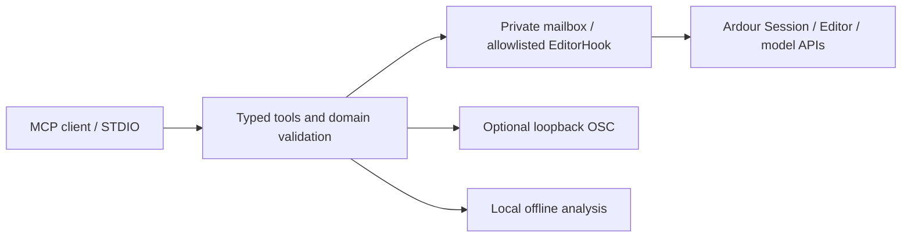

# Ardour Ultra MCP

A local, free, open source programmable control layer for Ardour over Model Context Protocol. It gives an MCP agent typed inspection and precise editing primitives through Ardour's real Lua APIs, with optional native OSC. No paid APIs, cloud services, proprietary models or GUI input automation.

**Working development release 0.1.0 — the complete production/cross-platform brief is not yet fulfilled.** Real Linux Ardour 9.8 editor tests cover internal MIDI editing, plugins, native undo, region copying/editing and master export with offline analysis. Ardour 8.12 common bindings are separately tested. macOS Apple Silicon and Windows 11 code paths require native verification. See [compatibility](docs/COMPATIBILITY.md), [test evidence](docs/TESTING.md) and [remaining gaps](docs/FINAL_GAP_ANALYSIS.md).

The server registers **80 typed tools**, **7 read-only resources** and **1 workflow prompt** using the current official Python MCP SDK 2.3.0 and specification 2026-07-28. Runtime capabilities tell the agent which operations the installed Ardour build actually supports. Persistent route/region/playlist/processor/group IDs, explicit units, source-relative 1920-quarter MIDI ticks, guarded note references, dense batches, preflight and structured change/error results make edits inspectable.

Install from this checkout; the package has **not been published to PyPI**:

```sh
cd /path/to/ardour-ultra-mcp
uv tool install '.[analysis]'
# alternative: pipx install '.[analysis]'
ardour-ultra-mcp install --ardour-major 9
```

Activate **Ardour Ultra MCP** as an Action Hook in Ardour's Script Manager. File IPC requires reviewing the installed script and disabling **Sandbox all Lua scripts** in scripting preferences. The installer prints the exact path/steps and does not change that preference. Open a disposable session first:

```sh
ardour-ultra-mcp test-connection --json
ardour-ultra-mcp doctor --json
ardour-ultra-mcp capabilities --json
ardour-ultra-mcp configure claude
ardour-ultra-mcp configure codex
```

Configuration commands print snippets for safe merging. Current direct setup commands:

```sh
claude mcp add --transport stdio --scope user ardour-ultra -- ardour-ultra-mcp serve
codex mcp add ardour-ultra -- ardour-ultra-mcp serve
```

Claude Desktop/generic STDIO configuration:

```json
{"mcpServers":{"ardour-ultra":{"command":"ardour-ultra-mcp","args":["serve"]}}}
```

Use an absolute executable path when needed. [Installation](docs/INSTALLATION.md) gives current paths, Codex TOML, PowerShell handling and explicit audio/export roots. `serve --backend fake` runs a deterministic simulator with labelled results; it does not produce Ardour audio.

Tools cover session save/snapshot, tracks/buses/groups, mixer/transport/record arm/monitor, region edits/copy, internal MIDI batches, generic plugins/parameters/presets, internal sends/ports, automation and experimental preset-based master export. Offline analysis measures peak/RMS/LUFS/estimated true peak/spectrum/stereo/silence and compares passes. [Generated tool reference](docs/TOOL_REFERENCE.md) is the exact API; arguments are wrapped in `{"request": {...}}`.



The security model is local STDIO, a private serialized mailbox, allowlisted commands, no arbitrary Lua/shell tools, default-deny media paths, new export directories, explicit delete intent and uncertain-outcome errors. Native undo and compensated control batches have different guarantees. Observed revisions do not cover every human edit. Windows DACL hardening, advanced MIDI events, audio import/stretch/crossfades, stems, sidechain pins, advanced workflow helpers and complete platform proof remain gaps. Read [security](docs/SECURITY.md) before enabling the hook.

Documentation: [quick start](docs/QUICK_START.md), [research](docs/RESEARCH.md), [architecture decision](docs/ARCHITECTURE_DECISION.md), [MIDI](docs/MIDI.md), [plugins](docs/PLUGINS.md), [automation](docs/AUTOMATION.md), [routing](docs/ROUTING.md), [analysis](docs/AUDIO_ANALYSIS.md), [development](docs/DEVELOPMENT.md), [testing](docs/TESTING.md), [release](docs/RELEASE.md), [troubleshooting](docs/TROUBLESHOOTING.md).

Python 3.11+; GPL-3.0-or-later; original implementation with no peer source copied. [Contributing](CONTRIBUTING.md), [dependency/license review](THIRD_PARTY_NOTICES.md), [implementation journal](docs/IMPLEMENTATION_STATUS.md).
