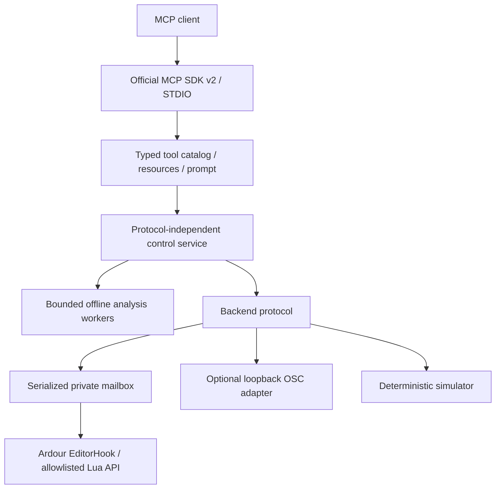

# Architecture

Resource/event subscriptions are disabled using the current SDK 2.3 interface; this server has no complete event publisher. Server discovery reports package version and actual protocol capabilities.

The catalog is the source of truth for request schemas, tool registration, categories and generated reference. Domain validation and file permissions happen before backend dispatch. MCP protocol logic contains no Ardour binding calls. Backend instances expose execute/capabilities/close. Editing, plugin and routing helpers remain separate modules in the simulator; the native Lua factory contains its own protocol and API handlers because Ardour serializes factories into persistent bytecode.

Lua is authoritative for stable-ID operations. Optional OSC exposes experimental native query/transport primitives without pretending UDP sends acknowledge execution. A received transport reply is not verified state: real 9.8 Dummy readback diverged from Lua; use Lua as authoritative. Composite forwards edits to Lua and describes OSC independently; it currently does not merge an OSC event stream into canonical state. It never silently changes object addressing or falls back after an ambiguous mutation.

Each mailbox exchange has protocol version, private nonce, random correlation ID, instance epoch and deadline. Python serializes async calls and OS file locks serialize clients. Atomic publish uses temp files and replace; Lua claims the fixed slot with rename before execution. Correlated replies preserve typed outcomes. A published timeout is never retried. Heartbeats identify stale hooks; export receives a longer timeout but busy UI can make health observation stale.

Use exact Ardour route/region/playlist/processor/group IDs via Stateful. Port names are qualified identifiers with lifetime tied to the backend. Notes have model-scoped snapshot references because bound NotePtr lacks persistent IDs. Read requests refresh actual state; no partial cache is presented as complete. Observed revisions cover route mixer, region and group summaries, not every human edit. Exact MIDI model fingerprints provide stronger target protection.

Native diffs group MIDI edits and region/automation changes where bound. Control batches compensate within an allowlist; no general ACID guarantee or grouped control undo is promised. See [security](SECURITY.md) and [architecture decision](ARCHITECTURE_DECISION.md).

Source layout: `server.py`, `services/catalog.py`, `services/control.py`, typed `models/`, `backends/`, packaged `bridge/bridge.lua`, `security/paths.py`, `installers/`, `state/timeline.py`, and optional `analysis/audio.py`. A canonical, fully typed session object graph and separate service class for every production domain are not complete in 0.1.0; state payloads use the shared structured result schema.
